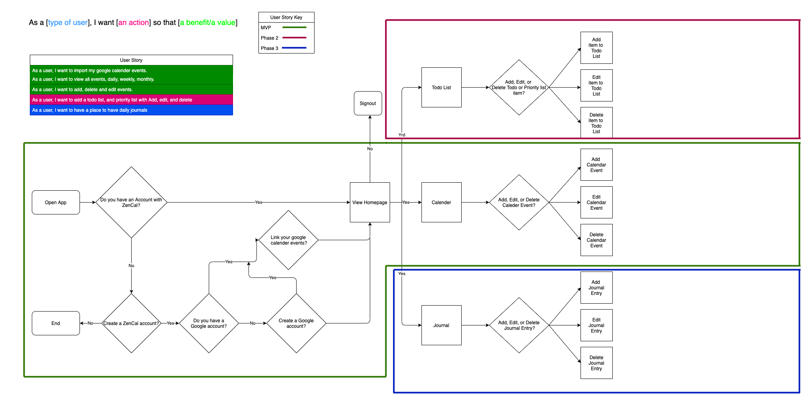
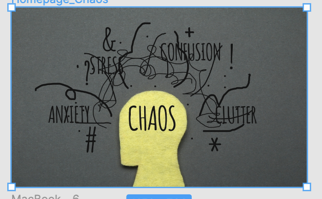
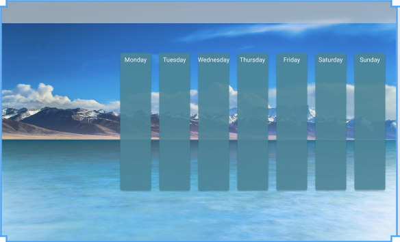
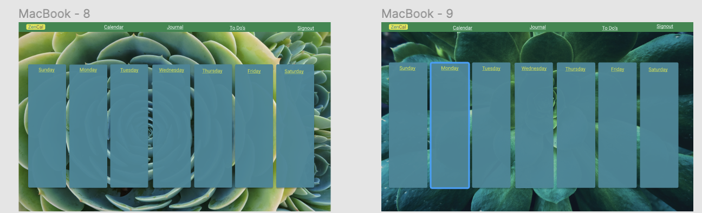
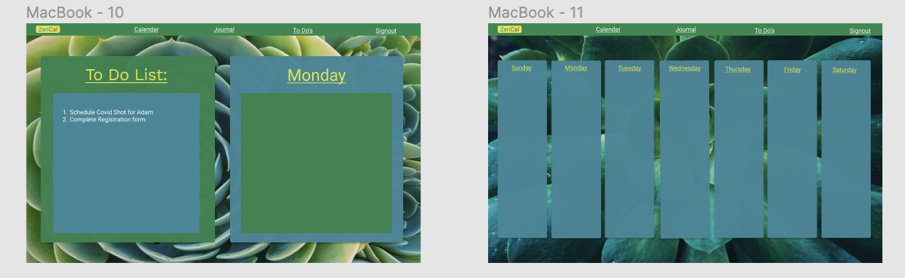
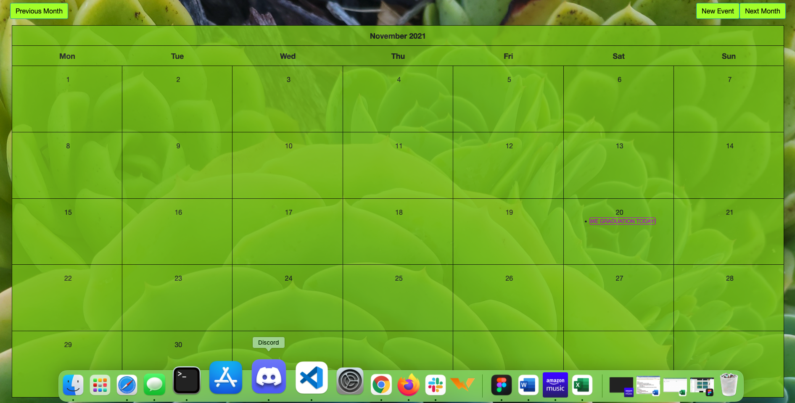

# FinalProject -ZenCal

## Technologies Used:
-Python 3.9 
-Django  
-PostgreSQL  
-Heroku  
-Draw.io  
-Figma  
-Trillo  

## How to Install Your Project:
1. Create file directory for GitHUB repository clone
2. CLI 'git clone https://github.com/Chrishoeffel/FinalProject.git'
3. cd into your project
4. CLI pipenv shell
5. pipenv install

## Purpose of the project:
The goal of the project is to create an online space to cellect my thought and become more organized.  
Objective:
1. create a visible calendar
2. add/delete events to calendar

Planning ALL Stemmed from the idea of a clam replaxing environment that is easy to use. 
 
Design process:  
 

 
 
 
 

# Challenges!
1. Time-management (Try to stay organized withg user flow, Trello)
2. Scope: Keeping focused on current stage 
3. Documentation: So many resources out there. Hard to determine what is best. 